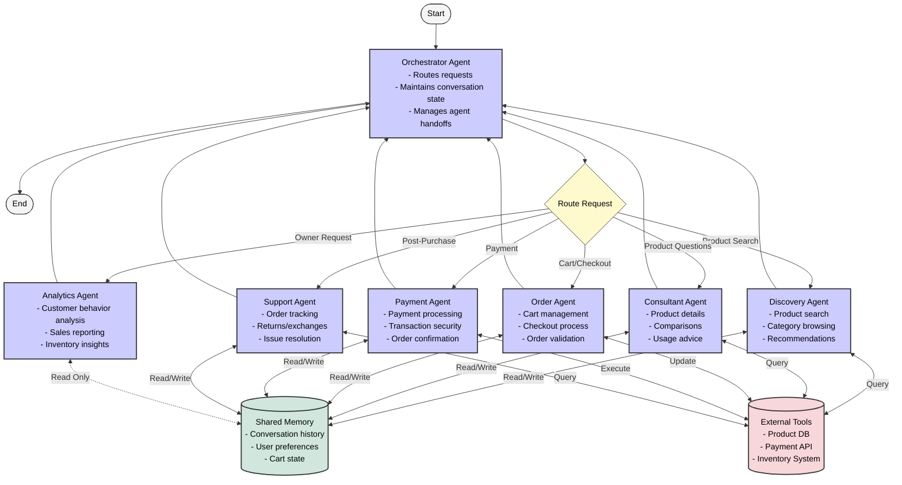

```mermaid
flowchart TD
    %% Nodes
    start([Start])
    
    end_([End])
    
    %% Agent Nodes
    orchestrator["Orchestrator Agent
    - Routes requests
    - Maintains conversation state
    - Manages agent handoffs"]
    
    discovery["Discovery Agent
    - Product search
    - Category browsing
    - Recommendations"]
    
    consultant["Consultant Agent
    - Product details
    - Comparisons
    - Usage advice"]
    
    order["Order Agent
    - Cart management
    - Checkout process
    - Order validation"]
    
    payment["Payment Agent
    - Payment processing
    - Transaction security
    - Order confirmation"]
    
    support["Support Agent
    - Order tracking
    - Returns/exchanges
    - Issue resolution"]
    
    analytics["Analytics Agent
    - Customer behavior analysis
    - Sales reporting
    - Inventory insights"]
    
    %% State Nodes
    state_router{"Route Request"}
    
    %% LangGraph State Nodes
    state_memory[("Shared Memory
    - Conversation history
    - User preferences
    - Cart state")]
    
    state_tools[("External Tools
    - Product DB
    - Payment API
    - Inventory System")]
    
    %% Main Flow
    start --> orchestrator
    orchestrator --> state_router
    
    state_router -->|"Product Search"| discovery
    state_router -->|"Product Questions"| consultant
    state_router -->|"Cart/Checkout"| order
    state_router -->|"Payment"| payment
    state_router -->|"Post-Purchase"| support
    state_router -->|"Owner Request"| analytics
    
    %% Return flows to orchestrator
    discovery --> orchestrator
    consultant --> orchestrator
    order --> orchestrator
    payment --> orchestrator
    support --> orchestrator
    analytics --> orchestrator
    
    orchestrator --> end_
    
    %% Shared state connections
    discovery <-->|"Read/Write"| state_memory
    consultant <-->|"Read/Write"| state_memory
    order <-->|"Read/Write"| state_memory
    payment <-->|"Read/Write"| state_memory
    support <-->|"Read/Write"| state_memory
    analytics <-.->|"Read Only"| state_memory
    
    %% Tool connections
    discovery <-->|"Query"| state_tools
    consultant <-->|"Query"| state_tools
    order <-->|"Update"| state_tools
    payment <-->|"Execute"| state_tools
    support <-->|"Query"| state_tools
    
    %% Styling
    classDef agent fill:#ccf,stroke:#333,stroke-width:2px,color:#000
    classDef state fill:#fffacd,stroke:#333,stroke-width:1px,color:#000
    classDef memory fill:#d1e7dd,stroke:#333,stroke-width:2px,color:#000
    classDef tools fill:#f8d7da,stroke:#333,stroke-width:2px,color:#000
    classDef endpoint fill:#f5f5f5,stroke:#333,stroke-width:1px,color:#000
    
    class orchestrator,discovery,consultant,order,payment,support,analytics agent
    class state_router state
    class state_memory memory
    class state_tools tools
    class start,end_ endpoint
```